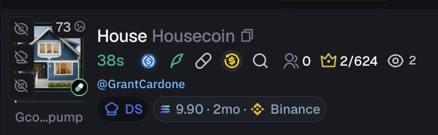

# Axiom Funding on Pulse

A lightweight Chrome extension that shows the **dev wallet funding source inline on every Pulse row** — no need to hover over the chef hat icon to see the tooltip.



## What it does

For each token on the Pulse page, if the developer's wallet was funded from a known source (CEX, bridge, or your personal Axiom tracker), the extension renders a small badge directly next to the dev volume pill:

```
[SOL] 9.90 · 2mo · [Binance logo] Binance
```

- **SOL amount** — how much SOL was sent to fund the dev wallet
- **Age** — how long ago the funding happened (min / h / d / mo / y)
- **Exchange icon + name** — resolved from a map of 104 known Solana CEX hot wallets, or your personal tracker name if the wallet is saved in Axiom

## How it works

Reads `devWalletFunding` directly from Axiom's React component tree — the same data their hover tooltip uses, so it's always accurate and requires no external API calls or WebSocket connection.

## Installation

1. Download or clone this repository
2. Open `chrome://extensions`
3. Enable **Developer mode**
4. Click **Load unpacked** and select this folder

## Supported exchanges

Binance, Coinbase, OKX, Bybit, Kraken, Kucoin, Upbit, MEXC, Robinhood, Moonpay, Phantom, Revolut, Wintermute, Crypto.com, Bitstamp, Blockchain.com, Whitebit, WOO, and 80+ more.
